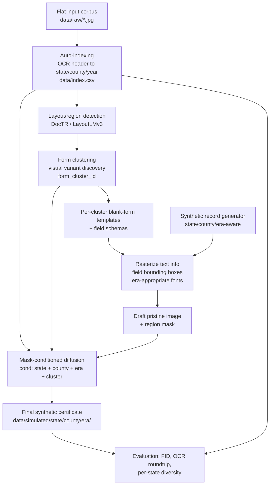

## Context

Repo is currently green-field — only [README.md](README.md) and `.gitattributes` exist. Per your direction, this plan **skips the Stage 1 classifier** and focuses entirely on the simulation pipeline.

**Input data assumption: pixels-only.** The project's only ground-truth signal is the image content itself. Files arrive as a flat `data/raw/*.{jpg,png}` collection with opaque filenames (e.g., `001234567_image001.jpg`) and no sidecar metadata. There is no pre-existing folder hierarchy by state or county, no manifest, no CSV from the source. Ground-truth labels `(state, county, year)` are derived by an **OCR-based indexing pass** that reads each certificate's printed header and emits `data/index.csv` as the single source of truth for every downstream phase. See "Auto-Indexing" in Phase 0 below for the approach and confidence story.

**Temporal scope: 1900-onwards only.** This is enforced once in [configs/states.yaml](configs/states.yaml) and applied as a `status` column in `data/index.csv` (rather than physically moving files), so 1900-cutoff decisions are reversible if reference data improves later. The README's collection table includes some pre-1900 sources (Connecticut 1600s+, Maine 1600s+, New Hampshire 1654–1959, Pennsylvania 1803–1915, Massachusetts 1841–1924, Hawaii 1841–1942, etc.); those collections are still usable, but only their 1900-onwards subsets feed this pipeline. Practical reasons to clamp at 1900: standardized state-issued death certificates only became widespread after the U.S. Death Registration Area expanded post-1900, ICD cause-of-death vocabularies stabilize after ICD-1 (1900), pre-1900 records vary wildly in form and language, and our era-conditioned name/cause/occupation pools become tractable.

## Architecture

The key idea: **the generative model never invents field values.** It receives a draft image where synthetic text has already been rendered into the right field regions, plus a binary mask marking where that text lives, plus state/era conditioning. Its job is to add paper texture, ink bleed, scan noise, handwriting-style smudging on the rendered text, and aging — all the "noise" you said you want preserved — without changing the field content. This keeps ground truth labels exact while letting realism come from the generative side.

## Phase 0 — Foundation

> **Simulation-only adjustment to the README's Phase 0.** The README's "Image Preprocessing" stage (deskewing, Sauvola binarization, CLAHE, 300-DPI normalization) is intentionally **not** part of this plan. Those steps were designed to make scans easier for a classifier; for a generative model they would erase the very paper aging, ink bleed, skew, and scan noise we need the model to learn. We do **resize-only** normalization at training time and preserve full color and native artifacts. The README's `data/processed/` folder is dropped from the project layout.

- Create the project skeleton (`src/`, `data/`, `models/`, `notebooks/`, plus `assets/`, `configs/`, and `reports/`). No `data/processed/`.
- Input data layout: **flat** `data/raw/*.{jpg,png}` with opaque filenames. No per-state, per-county, or per-collection folders are assumed. Ground-truth labels are produced from pixels only, by the auto-indexing step below.
- [.gitignore](.gitignore): exclude `models/` (multi-GB diffusion + ControlNet checkpoints), `mlruns/`, `data/raw/`, `data/simulated/`, `data/synth_drafts/`, `data/index.csv` (regenerable), `assets/fonts/*.ttf` (license-restricted fonts), `.env`, `__pycache__/`, `*.pyc`, `.ipynb_checkpoints/`. The repo currently has no `.gitignore` — adding one before any large artifact lands is critical.
- [requirements.txt](requirements.txt): `torch`, `diffusers`, `transformers`, `accelerate`, `datasets` (Hugging Face data loading), `internetarchive` (Tier 2 bulk download), `opencv-python`, `python-doctr`, `paddleocr` (handwriting fallback), `faker`, `pydantic`, `pyyaml`, `pillow`, `numpy`, `pandas`, `rapidfuzz` (county-name fuzzy matching), `tqdm`. (`scikit-image` is dropped. `mlflow` is added in Phase 3 — see "Why MLflow?" below.) Pin to latest stable versions during install.
- [configs/data.yaml](configs/data.yaml): canonical pipeline config — file types, the flat-folder input contract, a global `min_year: 1900` filter, OCR confidence thresholds for the auto-indexer, and an explicit **normalization policy: resize-only** (no binarization, no deskew, no CLAHE; color preserved; target resolution chosen at Phase 3 to match the diffusion backbone, e.g., 1024×1024 for SDXL).
- [configs/states.yaml](configs/states.yaml): per-state era ranges (clamped to `[1900, …]`), county lists, source-specific quirks pulled from the README's collection table. A small loader [src/config/states.py](src/config/states.py) exposes a single `get_state_eras(state)` helper so every downstream phase reads the same source of truth.

### Auto-Indexing — pixels → `(state, county, year)` ground truth

This is the single most important new piece in the simulation-only plan. Because we are not given any external metadata, the OCR-derived index in [data/index.csv](data/index.csv) becomes the canonical ground-truth that every downstream phase joins against. Folding the 1900+ filter into this same OCR pass means we make exactly one pass over the corpus.

- [src/indexing/build_index.py](src/indexing/build_index.py): one-shot batch indexer. For each file in `data/raw/`:
  1. Crop the **top 20%** of the image (the header band where state/county are printed) and run DocTR. State extraction operates only on this crop — restricting the OCR region kills false positives like body-text mentions of "born in NEW YORK" appearing on a Michigan certificate.
  2. Crop the **top 35%** (a slightly larger band including the issuing-county field) and run DocTR for county extraction.
  3. Run DocTR on the full image once and extract all `19[0-4]\d` tokens for year extraction.
  4. Optional second pass with PaddleOCR if DocTR yields low confidence on county (PaddleOCR handles handwritten fill-ins better, which is common for the county field on pre-1925 forms).
  5. Write one row per file to `data/index.csv` with the full result.
- [src/indexing/state_dict.py](src/indexing/state_dict.py): curated regex/dictionary for state extraction. Patterns must be anchored to header-style framings, e.g., `(?i)(state of|commonwealth of|territory of|department of health of)\s+(massachusetts|mass\.)` — the four Commonwealths (MA, PA, VA, KY) and the Territory framings for early Hawaii/Alaska are explicit cases. Output: `(state_code, confidence)`.
- [src/indexing/county_match.py](src/indexing/county_match.py): given the OCR'd county text and the predicted state + year, fuzzy-match against `data/reference/counties_by_state_year.json` using `rapidfuzz`. Only counties that legally existed in that state at that year are valid candidates — this both improves accuracy and prevents anachronisms (e.g., a 1908 Florida certificate mentioning a county created in 1921 is a sign of an OCR error, not ground truth). Output: `(county_name, confidence)`.
- [src/indexing/year_extract.py](src/indexing/year_extract.py): cluster all `19[0-4]\d` tokens found on the page; weight by proximity to keywords like "filed", "registered", "date of death"; pick the dominant year. Output: `(year, confidence)`.

**`data/index.csv` schema:**

| column | type | notes |
| --- | --- | --- |
| `filename` | string | relative path under `data/raw/` |
| `state` | string | two-letter code; empty if unknown |
| `state_conf` | float | 0–1 |
| `county` | string | canonical name from reference data; empty if unknown |
| `county_conf` | float | 0–1 |
| `year` | int | 4-digit; -1 if unknown |
| `year_conf` | float | 0–1 |
| `status` | enum | see below |
| `raw_header_ocr` | string | first 500 chars of header OCR for audit |

`status` values:
- `confirmed` — `state_conf ≥ 0.9` and `county_conf ≥ 0.7` and `year_conf ≥ 0.8` and `year ≥ 1900`. Used for downstream training.
- `needs_review` — at least one field below threshold but not catastrophically wrong. Surfaced in the review notebook below.
- `rejected_pre_1900` — year confidently `< 1900`. Excluded from downstream phases.
- `rejected_unreadable` — header OCR returned essentially nothing. Also excluded.

- [notebooks/00_index_review.ipynb](notebooks/00_index_review.ipynb): visualizes every `needs_review` row alongside its source image and the raw OCR text, so the user can override fields by editing `data/index.csv` in place. Manual review is the safety valve — we don't try to be perfect, we try to be auditable.

**Known failure modes the indexer must tolerate:**
- *Cropped scans* missing the header → status becomes `rejected_unreadable`, surfaced for manual entry.
- *Non-standard issuing wording* (e.g., "Bureau of Vital Statistics, Department of Health, State of …" with the state name on a separate line) → handled by running OCR with paragraph reconstruction enabled in DocTR.
- *Handwritten counties* (common on early forms) → PaddleOCR fallback + `rapidfuzz` against the historical county list, which corrects most spelling errors.
- *Bilingual/non-English forms* (early Louisiana, brief Hawaii territorial period) → state dictionary includes the alternate-language framings; otherwise → `needs_review`.

### Phase 0 simulation-specific assets (Phase 2 hard-depends on these)

These two registries are the reason Phase 0 has any real content beyond scaffolding. Without them curated up front, Phase 2's `RecordGenerator` and `render.py` cannot run, and the auto-indexer's county validation depends on the historical county lookup.

- [assets/fonts/](assets/fonts/) + [assets/fonts/fonts.yaml](assets/fonts/fonts.yaml): era-tagged font registry mapping `(era_bucket, field_type)` → font file. Buckets: `1900–1909`, `1910–1919`, `1920–1929`, `1930–1939`, `1940+`. Field types: `typewriter` (printed-form labels), `typewriter_handfilled` (typed values, common 1920s+), `handwriting_dip_pen` (handwritten values pre-1925-ish), `handwriting_ballpoint` (mid-century). Use freely-licensed historical fonts (e.g., the `Pelkistetty` and `Special Elite` families, OFL-licensed handwriting fonts). License notes per font are tracked in `fonts.yaml`. Actual `.ttf` files are gitignored; `fonts.yaml` is checked in so the registry is reproducible.
- [data/reference/](data/reference/): historical reference data.
  - `names_by_era.json`: era-conditioned first-name and surname pools (SSA baby names dataset filtered to 1900+, US Census surname frequencies, optional regional/ethnic biasing).
  - `counties_by_state_year.json`: **historical county FIPS lookup** keyed by `(state, year)`. This is non-trivial — many counties were created, renamed, or boundary-changed between 1900 and 1950 (e.g., several Virginia independent cities, Dakota Territory splits predate us). Source: NHGIS or the Atlas of Historical County Boundaries. **Used by both the auto-indexer (to validate OCR'd county names) and the synthetic record generator (to avoid producing anachronistic counties).**
  - `icd_causes_by_era.json`: era-appropriate cause-of-death vocabulary. ICD-1 (1900–1909), ICD-2 (1910–1920), ICD-3 (1921–1929), ICD-4 (1930–1938), ICD-5 (1939–1948). Each entry tagged with rough prevalence so the generator can sample realistically (tuberculosis weights heavily 1900–1925, influenza spikes 1918, heart disease rises post-1940).
  - `occupations_by_era.json`: era-appropriate occupation list, drawn from Census occupation taxonomies of the period.
- [src/reference/loader.py](src/reference/loader.py): thin loader exposing `get_names(era, region)`, `get_counties(state, year)`, `get_causes(era)`, `get_occupations(era)`. One source of truth, one import path.

### Sample data acquisition — tiered strategy

There is **no general-purpose, prepped, multi-state US death-certificate ML dataset** on Kaggle, Hugging Face, or any academic repository as of 2026-05. The closest equivalents are state-specific. The plan therefore uses a tiered acquisition strategy that delivers usable data fast (Tier 1) before scaling (Tier 2), and defers multi-state collection (Tier 3) until the pipeline is proven on a single state.

- **Tier 1 — Pilot dataset (used to bring up the pipeline end-to-end on a tiny, fully-labeled corpus):**
  - **`Rasi1610/Deathce502_series1_new`** on Hugging Face — 367 Baltimore City Maryland death certificates from 1950, with ground-truth structured fields (deceased name, date, state file number, city, gender, race, marital status, birth date, age, birthplace, parents). The labels make this dataset doubly valuable: it bootstraps the pipeline *and* serves as the validation set for the auto-indexer.
  - [src/data/fetch_pilot.py](src/data/fetch_pilot.py): downloads the dataset via `datasets.load_dataset("Rasi1610/Deathce502_series1_new")`, writes images to `data/raw/`, and emits `data/index_pilot_groundtruth.csv` containing the dataset's structured labels mapped to our schema. The auto-indexer is run separately and its predictions in `data/index.csv` are diffed against `index_pilot_groundtruth.csv` by a small evaluation script.

- **Tier 2 — Bulk training dataset (used for Phase 3 diffusion training):**
  - **Maryland State Archives via Reclaim The Records on Internet Archive** ([archive.org/details/marylandstatearchives](https://archive.org/details/marylandstatearchives)) — 5+ million digitized Maryland vital records, fully public, no login, no API throttling, bulk-downloadable. Specific high-value slice: `reclaim-the-records-maryland-death-certificates-msa-se-43-006781-7884` (Maryland 1941–1944).
  - [src/data/fetch_maryland.py](src/data/fetch_maryland.py): downloads selected Internet Archive items via the `internetarchive` Python client, extracts certificate images, and drops them into `data/raw/`. Resumable via filename hashing.
  - Coverage assumption: the bulk Maryland slice gives us thousands of (state=MD, multi-county, multi-decade) certificates — enough to train a single-state simulation pipeline end-to-end and validate the architecture before scaling.

- **Tier 3 — Multi-state expansion (deferred until Tier 1 + Tier 2 prove the pipeline):**
  - Falls back to the README's existing FamilySearch API path (Alabama, California, Massachusetts, Michigan, etc.). Do not pursue this until Tier 2 has produced an end-to-end working simulator on Maryland.
  - [src/data/fetch_familysearch.py](src/data/fetch_familysearch.py) is a stub at this phase; full implementation deferred.

- [configs/data_sources.yaml](configs/data_sources.yaml): registry of available sources with `{tier, name, url, license, expected_states, expected_eras, fetch_module}`. Single source of truth for data provenance.

- **Architectural prior art worth referencing during implementation:**
  - **`DHBern/death_register_extraction`** (GitHub, January 2026) — a Swiss Zurich death-register pipeline using YOLO for layout, TrOCR for handwriting, and LLM-based post-processing. Same pipeline shape as ours; useful reference for the Phase 1 layout-detection and Phase 5 OCR-roundtrip steps.
  - **DARE Database** (Zenodo, 163k+ cropped Swedish/Danish handwritten date fields) — useful as auxiliary fine-tuning data for handwritten-date OCR if the auto-indexer struggles with year extraction on degraded scans.

### Auto-indexer validation strategy (Phase 0 closing deliverable)

Because the Tier 1 pilot dataset arrives with ground-truth labels, the auto-indexer's accuracy is measurable on day one rather than guessed at:

- [src/indexing/validate.py](src/indexing/validate.py): runs the auto-indexer on the 367 pilot images and compares predicted `(state, county, year)` against `data/index_pilot_groundtruth.csv`. Reports per-field accuracy and a confusion matrix. **Acceptance threshold for Phase 0 to be considered complete: ≥95% state accuracy, ≥80% county accuracy, ≥90% year accuracy on the pilot set.** If we miss those, the indexer needs another pass before any downstream phase starts consuming `data/index.csv`.
- This validation also tells us which OCR confidence thresholds in [configs/data.yaml](configs/data.yaml) are calibrated correctly.

Phase 0 deliverable check: a fresh contributor can clone the repo, `pip install -r requirements.txt`, run `python -m src.data.fetch_pilot`, run `python -m src.indexing.build_index`, run `python -m src.indexing.validate`, and see auto-indexer accuracy numbers reported against the Hugging Face ground-truth labels. Optional: run `python -m src.data.fetch_maryland --slice msa-se-43-006781-7884` to pull bulk Tier 2 data once the pilot validation passes.

## Phase 1 — Layout & Template Inventory

This is the most important "feature representation" phase — without good templates and field schemas, the generative model has no way to be controllable.

All Phase 1 tools read from `data/index.csv` filtered to `status == 'confirmed'` and group images by `(state, county, era_bucket)` from that index, rather than walking a folder hierarchy.

### Conditioning hierarchy: `(state, county, era_bucket)` plus a learned `form_cluster_id`

Death certificates vary along three axes the pipeline must respect, but those axes don't have equal cardinality, and the **visual** axis and the **content** axis don't align cleanly:

- **State** — biggest visual signal. Different states issued meaningfully different forms.
- **County** — second-biggest visual signal. Most counties used the state-default form, but large counties (Wayne MI, Cook IL, NYC's boroughs, Suffolk MA, Hudson NJ, etc.) and many independent cities (Baltimore, St. Louis, Virginia independent cities) printed their own customized forms with extra fields, custom seals, distinct typesetters. The README itself reflects this by listing NYC and NY State as separate entries.
- **Era** — within the same state+county, forms evolved over time (a 1908 Wayne MI form ≠ 1942 Wayne MI form). Era also constrains *plausible content*: name pools, occupations, ICD cause-of-death vocabularies all shift by decade.

A naive `(state, county, era)` joint conditioning explodes cardinality (~50 × 3000 × 5 ≈ 750k cells, most empty). To avoid that, Phase 1 separates **visual form identity** from **geographic identity**:

- **`form_cluster_id`** — small learned vocabulary (~80–150 clusters across all states) discovered by clustering confirmed images on visual layout features. Most counties collapse to a "state default" cluster; the long tail captures the genuinely-distinct urban-county and independent-city forms.
- **`(state, county_fips, era_bucket)`** — preserved separately as the *content* axis, driving field-value generation (names, occupations, causes, registration-stamp text) and providing a secondary fine-grained visual signal for the generative model (county seals, registrar stamps).

The same image carries both labels in `data/index.csv` after Phase 1 runs.

### Phase 1 deliverables

- [src/layout/region_detect.py](src/layout/region_detect.py): run DocTR (or LayoutLMv3) over every confirmed image to produce text-region polygons and a coarse semantic label per region (printed-form text vs. handwritten fill-in vs. stamp/seal). Reuses OCR results cached by the auto-indexer to avoid re-running.
- [src/layout/form_cluster.py](src/layout/form_cluster.py): cluster confirmed images by visual form identity. Feature vector per image = perceptual hash of the printed-form skeleton (handwritten regions inpainted out) + a coarse signature of region-detection results (count, position, size of printed-text regions). Cluster with HDBSCAN over those features. Output:
  - `data/clusters/cluster_assignments.csv` — one row per image with `filename, form_cluster_id`.
  - `data/clusters/cluster_summary.csv` — one row per cluster with `form_cluster_id, dominant_state, dominant_counties, era_span, n_samples` for human review.
  - The `form_cluster_id` column is back-filled into `data/index.csv` so all downstream phases have it.
- [src/layout/template_extract.py](src/layout/template_extract.py): for each `form_cluster_id`, produce a **blank-form template image** by inpainting out handwritten regions and median-blending the printed structure across the cluster's samples. Output: `data/templates/{form_cluster_id}/template.png`. Most state-default clusters will be sample-rich and yield clean templates; rare urban-county clusters may be sample-poor and need manual touch-up.
- [src/layout/field_schema.py](src/layout/field_schema.py): produce `data/templates/{form_cluster_id}/field_schema.json` — list of fields with `{name, bbox, font_hint, expected_value_type, multiline}`. Field types: `person_name`, `date`, `place_of_birth`, `cause_of_death`, `occupation`, `sex`, `age`, `race`, `informant_name`, `physician_name`, `burial_place`, plus county-specific extras where present. Era buckets are drawn from `configs/states.yaml` (typical buckets: `1900–1909`, `1910–1919`, `1920–1929`, `1930–1939`, `1940+`).
- [src/layout/resolve_template.py](src/layout/resolve_template.py): exposes `resolve(state, county_fips, era_bucket) -> form_cluster_id` for downstream use. Built from `cluster_summary.csv` plus a fall-through rule: if no cluster matches the requested `(state, county, era)`, fall through to the state-default cluster for that era.
- [notebooks/01_layout_eda.ipynb](notebooks/01_layout_eda.ipynb): visual QA of clusters, templates, and field schemas. Catches obvious clustering errors (e.g., NYC certificates accidentally grouped with NY State) before they propagate downstream.

Deliverable: a curated `data/templates/` tree keyed by `form_cluster_id`, plus enriched `data/index.csv` with both geographic labels and the cluster assignment.

## Phase 2 — Synthetic Field-Value Generator

- [src/synth/values.py](src/synth/values.py): a `RecordGenerator` class that, given `(state, era, county?)`, produces a structured record honoring inter-field consistency:
  - DOB / DOD / age must agree.
  - County must exist for that state in that era.
  - Cause of death drawn from era-appropriate ICD vocabulary (1900s–1940s causes differ heavily from later decades).
  - Names drawn from era-conditioned name pools; surname distributions can be biased per region.
  - Occupation, race, and demographic fields constrained by census-era distributions.
- [src/synth/render.py](src/synth/render.py): given a record + a `field_schema.json` + a template image, rasterize each field's text into its bbox using a font appropriate to the era (typewriter / handwriting font fallback). Return `(draft_image, region_mask)` where `region_mask` is a binary mask of all rendered text pixels.
- [src/synth/cli.py](src/synth/cli.py): `python -m src.synth.cli --state michigan --county wayne --era 1925 --count 100` produces drafts to `data/synth_drafts/`.

Deliverable: any number of drafts can be generated for any (state, county, era), each with exact ground-truth field values and a region mask.

## Phase 3 — Generative Model for Visual Realism

- [src/gen/dataset.py](src/gen/dataset.py): builds training pairs `(real_image, reconstructed_template_with_text_rendered_back, region_mask, state, county_fips, era_bucket, form_cluster_id)`. The "reconstructed" image uses the OCR'd text from each real certificate re-rendered onto the matching template — so the model learns the transformation `(clean draft) -> (real-looking image)` rather than the much harder `noise -> image`. Image set is enumerated by joining `data/index.csv` (filtered to `status == 'confirmed'`) with the per-cluster templates produced in Phase 1.
- [src/gen/model.py](src/gen/model.py): mask-conditioned latent diffusion. Recommended starting point: **SDXL or SD 1.5 base + ControlNet** where the ControlNet input is `concat(draft_image, region_mask)`. The conditioning vector is `(state, county_fips, era_bucket, form_cluster_id)`:
  - `form_cluster_id` carries the dominant visual structure signal — the form template the model is being asked to "weather".
  - `state` and `era_bucket` go through the cross-attention text path as a natural-language prompt (`"a {era_bucket} {state} death certificate, county {county_name}"`), which lets us leverage pretrained text-encoder priors.
  - `county_fips` is also passed through a small learned categorical embedding concatenated to the ControlNet conditioning, so urban-county-specific stamps and seals can be conditioned on.
  - **Conditioning dropout**: during training, randomly drop `county_fips` (10%) and `era_bucket` (10%) so the model still produces sensible output when called with partial conditioning at inference (useful when the auto-indexer leaves county or year as `unknown`).
  - Rationale for ControlNet: gives us the spatial control we need cheaply; from-scratch diffusion is research-aligned but adds months.
- [src/gen/train.py](src/gen/train.py): standard diffusion training loop with `accelerate`, MLflow logging, gradient checkpointing.
- [configs/gen_train.yaml](configs/gen_train.yaml): hyperparameters, data paths, conditioning schema.
- Trade-off to revisit at Phase 3 review: SDXL+ControlNet (fast to working result, ~12GB VRAM at training, leans on pretrained features) vs. domain-specific U-Net trained from scratch (more aligned with the "represent state features faithfully" thesis, but 5–10× more compute and data-hungry). **Recommend starting with SDXL+ControlNet, then re-evaluating after baseline FID.**

### Why MLflow? (and why only starting at Phase 3)

MLflow is in the README's tech stack, but it earns its keep only once we hit a training/iteration loop. Concretely, this pipeline will produce **dozens of runs we need to compare side-by-side**, and that's where ad-hoc logging falls apart:

- **Hyperparameter sweeps in Phase 3.** Diffusion fine-tuning has many knobs that interact non-obviously: learning rate, batch size, ControlNet conditioning channels (`draft_image` only vs. `draft_image + region_mask` vs. `+ era heatmap`), text-prompt template wording, EMA decay, number of denoising steps at eval. We will run 10+ training configurations before settling on one. MLflow's run-comparison UI exists exactly for this.
- **Per-state metric tracking across runs.** Phase 5 produces one FID per state (50 numbers), one OCR-roundtrip accuracy per state, and one diversity score per state. Across 10 runs that's 1500+ scalars. Tracking these in CSVs by hand becomes the bottleneck. MLflow lets you log them as nested metrics and chart "FID for Michigan vs. Virginia across all runs" in one click.
- **Sample-image artifacts per checkpoint.** During training we'll periodically generate a fixed-seed grid of synthetic certificates so we can eyeball quality drift. MLflow stores these as artifacts pinned to the run + checkpoint, which is much more useful than a folder of timestamped PNGs.
- **Reproducibility tied to git commit.** MLflow auto-captures the git SHA per run; combined with `configs/gen_train.yaml`, any run can be rerun deterministically. This matters because we are explicitly defending the thesis "state features can be faithfully represented" — when a reviewer asks "which run produced figure 3?" we need an answer.
- **Cheap alternatives considered.** TensorBoard handles scalars/images but not config-versioning or run-comparison well. Weights & Biases is more polished but requires an account/cloud. Plain CSV + folder dumps work for a handful of runs and become unmanageable past ~5. MLflow's local file backend (`mlruns/`) gives us the durable, queryable, reproducible record without external dependencies — best fit for a solo-researcher project that may need to audit its own results months later.

**Phases 0–2 do not need MLflow.** Those phases produce deterministic, mostly one-shot artifacts (configs, templates, field schemas, draft renderers) that are git-tracked or live under `data/templates/`. Adding MLflow there would be ceremony without payoff. So MLflow setup moves to a Phase 3 deliverable, not a Phase 0 one.

## Phase 4 — Compositing & Inference

- [src/inference/simulate.py](src/inference/simulate.py): end-to-end CLI. `python -m src.inference.simulate --state michigan --county wayne --era 1925 --count 500` performs:
  1. `resolve_template.resolve(state, county_fips, era_bucket)` returns the matching `form_cluster_id` (Wayne County in this example resolves to its custom MI urban form; a rural MI county would resolve to the state-default cluster for that era).
  2. `RecordGenerator` produces 500 synthetic records keyed to `(state, county, era)` so field values stay county- and era-appropriate.
  3. `synth/render.py` rasterizes each record onto the resolved cluster's template image with era-appropriate fonts.
  4. The trained diffusion model runs over each draft + mask + conditioning vector `(state, county_fips, era_bucket, form_cluster_id)`, producing realistic outputs.
  5. Outputs land in `data/simulated/{state}/{county}/{era}/{record_id}.jpg` with a sidecar `{record_id}.json` holding the ground-truth fields.
- Optional flags: `--noise-strength` to control how aggressively the generative model degrades the draft, and `--allow-unknown-county` to use the state-default cluster when no county is supplied.

## Phase 5 — Evaluation

- [src/eval/fidelity.py](src/eval/fidelity.py): per-state FID against the real corpus, where "the real corpus for state X" is defined as the rows of `data/index.csv` with `status == 'confirmed'` and `state == 'X'`.
- [src/eval/ocr_roundtrip.py](src/eval/ocr_roundtrip.py): OCR each simulated image and compare extracted field values against the ground-truth record. This is the single most important metric — it directly tells you whether realism is destroying label fidelity.
- [src/eval/diversity.py](src/eval/diversity.py): stratified diversity metrics over counties, eras, name pools, causes of death.
- [reports/simulation_eval/](reports/simulation_eval/): markdown reports + sample grids per state.
- Tie-back to your original thesis ("if I can't classify state features, I can't simulate them"): once a Stage 1 classifier eventually exists, plug it in here as an auxiliary discriminator — but it is not a dependency of this plan.

## Key trade-offs the plan defers to implementation time

- **Template granularity**: per-state vs. per-(state, era, variant). Start coarse, refine.
- **Text rendering pre vs. post diffusion**: rendering pre-diffusion (chosen) keeps labels controllable; rendering post-diffusion would let the model "write" text but loses ground truth. Worth a small ablation.
- **Compute**: a single GPU with ≥16GB VRAM is sufficient for SDXL+ControlNet fine-tuning on a per-state basis with batched accumulation; document the assumed compute envelope in `configs/gen_train.yaml`.