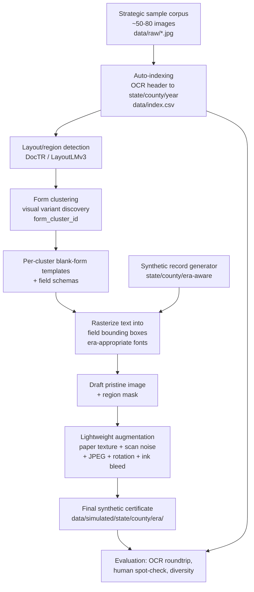

## Context and Purpose

Repo is currently green-field — only [README.md](README.md) and `.gitattributes` exist.

**Primary use case: dev/test data for insurance document parsing pipelines.** The output is synthetic death certificates realistic enough that a parsing system (human reviewer or automated) cannot trivially reject them as fake, but containing no real PII or PHI. This is a standard synthetic test data problem, not a research generative modeling problem. That distinction drives the key architectural simplification below.

**The diffusion model is removed from this plan.** The original plan included a mask-conditioned SDXL+ControlNet training pipeline (Phase 3) to achieve visual realism. For a dev/test data use case, that's months of work for marginal benefit. A lightweight noise augmentation layer — paper texture overlay, scan noise, JPEG compression artifacts, slight rotation, ink bleed simulation — achieves "real enough for testing" at a fraction of the cost. The pipeline therefore ends at Phase 3 (augmentation) rather than the original Phase 5.

**Input data assumption: pixels-only.** Files arrive as a flat `data/raw/*.{jpg,png}` collection with opaque filenames and no sidecar metadata. Ground-truth labels `(state, county, year)` are derived by an OCR-based indexing pass that emits `data/index.csv` as the single source of truth for every downstream phase.

**Temporal scope: 1900-onwards only.** Enforced once in [configs/states.yaml](configs/states.yaml) and applied as a `status` column in `data/index.csv`. Reasons: standardized state-issued death certificates only became widespread after the U.S. Death Registration Area expanded post-1900; ICD cause-of-death vocabularies stabilize after ICD-1 (1900); pre-1900 forms vary wildly in layout and language.

---

## Architecture



**The key idea is unchanged:** the pipeline never invents field values inside a generative model. Synthetic text is rendered into known field regions on a clean template, producing a draft with exact ground-truth labels. The augmentation layer then adds visual degradation — paper texture, scan noise, compression artifacts — to make the result look like a real scanned document. This keeps ground-truth labels exact while delivering the "real enough" threshold needed for dev testing.

---

## Why not chase full county coverage?

Death certificates vary by county even within a state, but pursuing one template per county is an indefinite data collection project (~3,000+ counties, many with multiple era variants). The right framing is: **cover the visual variation space, not every county**.

In practice, county-level form variation clusters into a much smaller number of distinct layouts:

- Most counties use the **state-default form** — identical or near-identical layout across the state.
- A handful of large urban counties (Cook IL, Wayne MI, NYC boroughs, Suffolk MA, Hudson NJ, Baltimore City, Virginia independent cities) printed **custom forms** with extra fields, different layouts, and custom seals.
- Within the same state+county, forms evolved by **era** — a 1910 form differs visually from a 1940 form.

The practical strategy: collect **50–80 samples strategically** — one or two per state for the default form, plus explicit samples for known high-variation urban counties. Phase 1's clustering step will empirically tell you how many visually distinct form types actually exist in that corpus. If 80 samples cluster into ~20 distinct layouts, you build 20 templates. That's your real coverage number. Any county without a matched template falls through to the state-default cluster for that era via `resolve_template`'s fall-through rule.

---

## Phase 0 — Foundation

> **No `data/processed/` folder.** The original README's image preprocessing stage (deskewing, Sauvola binarization, CLAHE, 300-DPI normalization) was designed for a classifier, not a generative pipeline. For our augmentation-based approach we do **resize-only** normalization and preserve full color and native artifacts, since those artifacts are what the noise layer is meant to reproduce.

- Create the project skeleton (`src/`, `data/`, `models/`, `notebooks/`, `assets/`, `configs/`, `reports/`). No `data/processed/`.
- Input data layout: **flat** `data/raw/*.{jpg,png}` with opaque filenames. No per-state or per-county folders assumed. Ground-truth labels come from the auto-indexing step.
- [.gitignore](.gitignore): exclude `data/raw/`, `data/simulated/`, `data/synth_drafts/`, `data/index.csv` (regenerable — but see manual overrides note below), `assets/fonts/*.ttf` (license-restricted), `__pycache__/`, `*.pyc`, `.ipynb_checkpoints/`. No `models/` or `mlruns/` needed since there is no training phase.
- [requirements.txt](requirements.txt): `torch`, `torchvision` (for augmentation transforms), `opencv-python`, `python-doctr`, `paddleocr` (handwriting fallback), `faker`, `pydantic`, `pyyaml`, `pillow`, `numpy`, `pandas`, `rapidfuzz`, `tqdm`, `datasets`, `internetarchive`. Pin to specific versions — do not rely on "latest stable." Diffusers, transformers, and accelerate have a history of breaking API compatibility between minor versions. **`mlflow` is not needed** — there is no training loop to track.
- [configs/data.yaml](configs/data.yaml): file types, flat-folder input contract, `min_year: 1900` filter, OCR confidence thresholds, **normalization policy: resize-only** (no binarization, no deskew, no CLAHE; color preserved).
- [configs/states.yaml](configs/states.yaml): per-state era ranges (clamped to `[1900, …]`), county lists, source-specific quirks. A small loader [src/config/states.py](src/config/states.py) exposes `get_state_eras(state)` as the single source of truth.

### Auto-Indexing — pixels → `(state, county, year)` ground truth

The OCR-derived index in [data/index.csv](data/index.csv) is the canonical ground truth that every downstream phase joins against. Because there is no external metadata, the auto-indexer makes exactly one pass over the corpus and the 1900+ filter is applied inline.

- [src/indexing/build_index.py](src/indexing/build_index.py): batch indexer. For each file in `data/raw/`:
  1. Crop the **top 20%** (header band) and run DocTR for state extraction. Restricting the region kills false positives like "born in NEW YORK" appearing on a Michigan certificate.
  2. Crop the **top 35%** and run DocTR for county extraction.
  3. Run DocTR on the full image and extract all `19[0-9]\d` tokens for year extraction. *(Note: the regex covers 1900–1999, not just 1900–1949, to handle 1950s samples like the Tier 1 pilot dataset.)*
  4. Optional PaddleOCR second pass if DocTR yields low confidence on county (PaddleOCR handles handwritten fill-ins better, common on pre-1925 forms).
  5. Write one row per file to `data/index.csv`.
- [src/indexing/state_dict.py](src/indexing/state_dict.py): curated regex/dictionary for state extraction. Patterns anchored to header framings: `(?i)(state of|commonwealth of|territory of|department of health of)\s+(massachusetts|mass\.)` — the four Commonwealths (MA, PA, VA, KY) and Territory framings for early Hawaii/Alaska are explicit cases. Output: `(state_code, confidence)`.
- [src/indexing/county_match.py](src/indexing/county_match.py): fuzzy-match OCR'd county text against `data/reference/counties_by_state_year.json` using `rapidfuzz`. Only counties that legally existed in that state at that year are valid candidates — this prevents anachronisms (a 1908 Florida certificate showing a county created in 1921 signals an OCR error, not ground truth). Output: `(county_name, confidence)`.
- [src/indexing/year_extract.py](src/indexing/year_extract.py): cluster all `19[0-9]\d` tokens; weight by proximity to keywords like "filed", "registered", "date of death"; pick the dominant year. Output: `(year, confidence)`.

**`data/index.csv` schema:**

| column | type | notes |
| --- | --- | --- |
| `filename` | string | relative path under `data/raw/` |
| `state` | string | two-letter code; empty if unknown |
| `state_conf` | float | 0–1 |
| `county` | string | canonical name from reference data; empty if unknown |
| `county_conf` | float | 0–1 |
| `year` | int | 4-digit; -1 if unknown |
| `year_conf` | float | 0–1 |
| `status` | enum | see below |
| `raw_header_ocr` | string | first 500 chars of header OCR for audit |

`status` values:
- `confirmed` — `state_conf ≥ 0.9` and `county_conf ≥ 0.7` and `year_conf ≥ 0.8` and `year ≥ 1900`. Used downstream.
- `needs_review` — at least one field below threshold. Surfaced in the review notebook.
- `rejected_pre_1900` — year confidently `< 1900`. Excluded.
- `rejected_unreadable` — header OCR returned essentially nothing. Excluded.

- [notebooks/00_index_review.ipynb](notebooks/00_index_review.ipynb): visualizes every `needs_review` row alongside its source image and raw OCR text so the user can override fields by editing `data/index.csv` in place.

> **Manual overrides note:** `data/index.csv` is gitignored as "regenerable," but any manual corrections made via the review notebook are silently lost on regeneration. Add a checked-in [data/manual_overrides.csv](data/manual_overrides.csv) that `build_index.py` applies as a final layer after the auto-indexer runs. This ensures corrections survive.

**Known failure modes the indexer must tolerate:**
- *Cropped scans* missing the header → `rejected_unreadable`, surfaced for manual entry.
- *Non-standard issuing wording* → handled by DocTR paragraph reconstruction.
- *Handwritten counties* → PaddleOCR fallback + `rapidfuzz` against historical county list.
- *Bilingual/non-English forms* (early Louisiana, Hawaii territorial) → alternate-language framings in state dictionary; otherwise `needs_review`.

### Phase 0 simulation-specific assets

- [assets/fonts/](assets/fonts/) + [assets/fonts/fonts.yaml](assets/fonts/fonts.yaml): era-tagged font registry mapping `(era_bucket, field_type)` → font file. Buckets: `1900–1909`, `1910–1919`, `1920–1929`, `1930–1939`, `1940+`. Field types: `typewriter` (printed-form labels), `typewriter_handfilled` (typed values, common 1920s+), `handwriting_dip_pen` (handwritten values, pre-1925-ish), `handwriting_ballpoint` (mid-century, post-1950). *(Note: ballpoint pens weren't widespread in the US until ~1950; use fountain/dip pen fonts for the 1940–1949 bucket.)* Use freely-licensed historical fonts (OFL-licensed). License notes per font tracked in `fonts.yaml`. Actual `.ttf` files are gitignored; `fonts.yaml` is checked in.
- [data/reference/](data/reference/): historical reference data.
  - `names_by_era.json`: era-conditioned first-name and surname pools (SSA baby names filtered to 1900+, US Census surname frequencies).
  - `counties_by_state_year.json`: historical county FIPS lookup keyed by `(state, year)`. Source: NHGIS or Atlas of Historical County Boundaries. Used by both the auto-indexer (county validation) and the record generator (anachronism prevention).
  - `causes_by_era.json`: era-appropriate cause-of-death vocabulary. ICD-1 (1900–1909), ICD-2 (1910–1920), ICD-3 (1921–1929), ICD-4 (1930–1938), ICD-5 (1939–1948), ICD-6+ (1949+). Each entry tagged with rough prevalence for realistic sampling. *(Historical accuracy of cause vocabulary matters less for dev/test use than for research, but keeping it plausible avoids obviously broken outputs.)*
  - `occupations_by_era.json`: era-appropriate occupation list from Census occupation taxonomies.
- [src/reference/loader.py](src/reference/loader.py): `get_names(era, region)`, `get_counties(state, year)`, `get_causes(era)`, `get_occupations(era)`.

### Sample data acquisition — tiered strategy

There is no general-purpose, prepped, multi-state US death-certificate ML dataset as of 2026-05. The plan uses a tiered acquisition strategy that prioritizes getting a working pipeline over complete coverage.

- **Tier 1 — Pilot dataset:**
  - `Rasi1610/Deathce502_series1_new` on Hugging Face — 367 Baltimore City Maryland death certificates from 1950 with ground-truth structured fields. Doubly valuable: bootstraps the pipeline and validates the auto-indexer.
  - [src/data/fetch_pilot.py](src/data/fetch_pilot.py): downloads via `datasets.load_dataset(...)`, writes to `data/raw/`, emits `data/index_pilot_groundtruth.csv` for auto-indexer validation.

- **Tier 2 — Bulk training corpus (for Phase 1 clustering):**
  - Maryland State Archives via Reclaim The Records on Internet Archive — 5M+ digitized Maryland vital records, fully public. Specific slice: `reclaim-the-records-maryland-death-certificates-msa-se-43-006781-7884` (Maryland 1941–1944).
  - [src/data/fetch_maryland.py](src/data/fetch_maryland.py): downloads via the `internetarchive` Python client, extracts certificate images to `data/raw/`. Resumable via filename hashing.
  - Coverage note: the Maryland bulk slice gives thousands of (state=MD, multi-county, multi-decade) certificates — enough to validate the pipeline architecture on a single state before expanding.

- **Tier 3 — Multi-state expansion (deferred):**
  - FamilySearch API path (Alabama, California, Massachusetts, Michigan, etc.). Do not pursue until Tier 2 has produced an end-to-end working simulator on Maryland.
  - [src/data/fetch_familysearch.py](src/data/fetch_familysearch.py): stub at this phase.
  - **Strategic collection note:** for multi-state expansion, don't aim for one sample per county. Collect one or two state-default samples per state, plus targeted samples for known high-variation urban counties (Cook IL, Wayne MI, NYC boroughs, Suffolk MA, Hudson NJ, Baltimore City, Virginia independent cities). ~50–80 total samples is a realistic target before running Phase 1 clustering.

- [configs/data_sources.yaml](configs/data_sources.yaml): registry with `{tier, name, url, license, expected_states, expected_eras, fetch_module}`.

### Auto-indexer validation strategy (Phase 0 closing gate)

- [src/indexing/validate.py](src/indexing/validate.py): runs the auto-indexer on the 367 pilot images, compares against `data/index_pilot_groundtruth.csv`. **Acceptance threshold: ≥95% state accuracy, ≥80% county accuracy, ≥90% year accuracy.** If missed, the indexer needs another pass before any downstream phase consumes `data/index.csv`.

Phase 0 deliverable check: clone repo → `pip install -r requirements.txt` → `python -m src.data.fetch_pilot` → `python -m src.indexing.build_index` → `python -m src.indexing.validate` → see accuracy numbers reported against Hugging Face ground truth.

---

## Phase 1 — Layout & Template Inventory

This is the most important phase for quality: without good templates and accurate field schemas, rendered text lands in the wrong place and the output is obviously fake.

All Phase 1 tools read from `data/index.csv` filtered to `status == 'confirmed'`.

### Conditioning hierarchy

Form variation runs along three axes:

- **State** — largest visual signal. Different states issued meaningfully different forms.
- **County** — second signal. Most counties used the state-default form; large urban counties and independent cities printed custom forms with extra fields and custom seals.
- **Era** — within the same state+county, forms evolved over time. Era also constrains plausible field content (name pools, occupations, ICD vocabularies shift by decade).

A naive `(state, county, era)` joint conditioning explodes cardinality (~50 × 3000 × 5 ≈ 750k cells, most empty). Phase 1 separates **visual form identity** (`form_cluster_id`) from **geographic/content identity** (`state`, `county_fips`, `era_bucket`):

- **`form_cluster_id`** — a small learned vocabulary (~20–80 clusters, empirically determined from the sample corpus) discovered by clustering on visual layout features. Most counties collapse to their state-default cluster; the long tail captures genuinely-distinct urban-county forms.
- **`(state, county_fips, era_bucket)`** — drives field-value generation and provides secondary fine-grained signal (county seals, registrar stamps).

### Phase 1 deliverables

- [src/layout/region_detect.py](src/layout/region_detect.py): run DocTR (or LayoutLMv3) over every confirmed image to produce text-region polygons and coarse semantic labels (printed-form text vs. handwritten fill-in vs. stamp/seal). Reuses OCR results cached by the auto-indexer.
- [src/layout/form_cluster.py](src/layout/form_cluster.py): cluster confirmed images by visual form identity. Feature vector = perceptual hash of the printed-form skeleton (handwritten regions inpainted out) + coarse region-detection signature (count, position, size of printed-text regions). Cluster with HDBSCAN. Output:
  - `data/clusters/cluster_assignments.csv` — one row per image with `filename, form_cluster_id`.
  - `data/clusters/cluster_summary.csv` — one row per cluster with `form_cluster_id, dominant_state, dominant_counties, era_span, n_samples`.
  - `form_cluster_id` back-filled into `data/index.csv`.
  - **Minimum cluster size policy:** any cluster with `n_samples < 15` is merged into the nearest state-default cluster for that era rather than producing its own template. Sample-poor clusters yield noisy templates that do more harm than good.
- [src/layout/template_extract.py](src/layout/template_extract.py): for each `form_cluster_id`, produce a blank-form template image by inpainting handwritten regions and median-blending the printed structure across the cluster's samples. Output: `data/templates/{form_cluster_id}/template.png`.
- [src/layout/field_schema.py](src/layout/field_schema.py): produce `data/templates/{form_cluster_id}/field_schema.json` — list of fields with `{name, bbox, font_hint, expected_value_type, multiline}`. Field types: `person_name`, `date`, `place_of_birth`, `cause_of_death`, `occupation`, `sex`, `age`, `race`, `informant_name`, `physician_name`, `burial_place`, plus county-specific extras.
- [src/layout/resolve_template.py](src/layout/resolve_template.py): `resolve(state, county_fips, era_bucket) -> form_cluster_id`. Fall-through rule: if no cluster matches, use the state-default cluster for that era.
- [notebooks/01_layout_eda.ipynb](notebooks/01_layout_eda.ipynb): visual QA of clusters, templates, field schemas. Catches obvious errors (e.g., NYC certificates grouped with NY State) before they propagate.

Deliverable: `data/templates/` tree keyed by `form_cluster_id`, plus enriched `data/index.csv` with cluster assignments.

---

## Phase 2 — Synthetic Field-Value Generator

- [src/synth/values.py](src/synth/values.py): `RecordGenerator` class. Given `(state, era, county?)`, produces a structured record honoring inter-field consistency:
  - DOB / DOD / age must agree.
  - County must exist for that state in that era.
  - Cause of death drawn from era-appropriate vocabulary. *(Historical accuracy is a "nice to have" for dev/test; the hard requirement is that values are plausible strings, not obviously wrong.)*
  - Names drawn from era-conditioned pools; surname distributions can be biased per region.
  - Occupation and demographic fields constrained by census-era distributions.
- [src/synth/render.py](src/synth/render.py): given a record + `field_schema.json` + template image, rasterize each field's text into its bbox using an era-appropriate font. Return `(draft_image, region_mask)` where `region_mask` is a binary mask of all rendered text pixels.
- [src/synth/export.py](src/synth/export.py): consolidates all per-record sidecar `.json` files for a run into a single flat `ground_truth.csv` at `data/synth_drafts/{run_id}/ground_truth.csv`. Each row is one certificate; columns are all generated fields plus a `filename` column linking each row to its corresponding image file. This is the primary ground-truth artifact for validation — easier to diff, open in Excel, and feed into automated test harnesses than a folder of individual JSON files. The per-record `.json` sidecars are retained as the authoritative source; the CSV is a derived view generated from them.
- [src/synth/cli.py](src/synth/cli.py): `python -m src.synth.cli --state michigan --county wayne --era 1925 --count 100 --seed 42` produces drafts to `data/synth_drafts/` and calls `export.py` automatically at the end of each run.

### Seeded generation and uniqueness

Without explicit controls, generating 10,000 certificates risks duplicate name+date combinations, which would break any parsing pipeline that does deduplication, identity resolution, or statistical sampling. The `RecordGenerator` addresses this with two complementary mechanisms:

**Deterministic seeding.** `RecordGenerator` accepts an integer `seed` parameter. Internally it initializes a `numpy.random.Generator` (via `numpy.random.default_rng(seed)`) and uses it exclusively for all sampling — name pool draws, date arithmetic, cause selection, occupation selection. This means:
- The same `seed` always produces the same sequence of records for the same `(state, era, county, count)` inputs.
- Different seeds produce different, non-overlapping sequences.
- Runs are fully reproducible: the seed is written into every sidecar `.json` alongside the ground-truth fields, so any output can be regenerated exactly.

```python
# Example usage
gen = RecordGenerator(state="michigan", era=1925, county="wayne", seed=42)
records = [gen.next() for _ in range(500)]
```

**Used-combination tracking.** For a given run, `RecordGenerator` maintains an in-memory set of `(first_name, last_name, dod)` tuples already emitted. If the sampler lands on a combination already in the set, it resamples (up to a configurable `max_retries`, default 20) before raising a `RecordExhaustionError`. This prevents duplicates within a single generation run without requiring a persistent database.

The combination space is large enough that collisions are rare in practice: even a 1920s Michigan run has thousands of plausible first names × thousands of surnames × ~3,650 days per decade = tens of billions of combinations. `RecordExhaustionError` in practice signals either a very large requested count or an unusually narrow `(state, era, county)` with a thin name pool — both of which are worth surfacing as errors rather than silently producing duplicates.

**Cross-run uniqueness (optional).** For teams that need guaranteed uniqueness across multiple generation runs (e.g., a CI pipeline that accumulates records over time), [src/synth/seen_store.py](src/synth/seen_store.py) provides a lightweight SQLite-backed store of used combinations keyed by `(state, era, county)`. Pass `--seen-store data/seen.db` to the CLI to activate it. This is opt-in — the default in-memory set is sufficient for most single-run use cases.

**Seed management in the CLI.** The `--seed` flag accepts an integer. If omitted, a random seed is drawn from `os.urandom` and logged to stdout so the run can be reproduced if needed. The seed is also written to a run manifest at `data/synth_drafts/{run_id}/manifest.json` alongside `(state, era, county, count, seed, timestamp)`.

Deliverable: any number of drafts for any `(state, county, era)`, each with exact ground-truth field values, a region mask, and a logged seed — plus a `ground_truth.csv` per run linking every image to its field values. **For the dev/test use case, these drafts alone — before augmentation — may already be sufficient for some parsing pipelines.** Evaluate at this stage before investing in Phase 3.

---

## Phase 3 — Lightweight Augmentation Layer

This phase replaces the original plan's SDXL+ControlNet diffusion training. The goal is "real enough for a parsing pipeline" — not "indistinguishable from a real scanned document." A simple augmentation stack achieves this in a fraction of the time and without GPU training.

- [src/augment/pipeline.py](src/augment/pipeline.py): composable augmentation pipeline applied to each draft image. Augmentations:
  - **Paper texture overlay**: blend a paper texture image (cream/yellowed, freely licensed) over the draft at low opacity (alpha 0.1–0.3). Simulates aged paper stock.
  - **Ink bleed**: slight Gaussian blur on the region mask, then blend blurred text pixels back to simulate ink spread into paper fibers.
  - **Scan noise**: add low-level Gaussian noise + optional horizontal scan-line artifacts.
  - **JPEG compression**: re-encode at quality 60–80 to simulate typical scan-to-JPEG degradation.
  - **Slight rotation/skew**: random rotation ±1–2 degrees. Real scanned documents are rarely perfectly straight.
  - **Brightness/contrast jitter**: slight variations to simulate scanner inconsistency.
- [configs/augment.yaml](configs/augment.yaml): tunable parameters for each augmentation (opacity ranges, noise sigma, JPEG quality range, rotation range). All parameters have sensible defaults; operators can tune for their target "how degraded should these look" threshold.
- [src/augment/cli.py](src/augment/cli.py): `python -m src.augment.cli --input data/synth_drafts/ --output data/simulated/ --config configs/augment.yaml` applies the pipeline to a folder of drafts.
- **No training loop, no MLflow, no GPU requirement.** This phase runs on CPU in seconds per image.

Deliverable: augmented synthetic certificate images that look like low-to-medium quality scans of real documents.

---

## Phase 4 — End-to-End Inference

- [src/inference/simulate.py](src/inference/simulate.py): end-to-end CLI. `python -m src.inference.simulate --state michigan --county wayne --era 1925 --count 500 --seed 42` performs:
  1. `resolve_template.resolve(state, county_fips, era_bucket)` returns the matching `form_cluster_id`.
  2. `RecordGenerator(seed=42)` produces 500 synthetic records deterministically.
  3. `synth/render.py` rasterizes each record onto the resolved cluster's template with era-appropriate fonts.
  4. Augmentation pipeline runs over each draft.
  5. Outputs land in `data/simulated/{state}/{county}/{era}/{record_id}.jpg` with a sidecar `{record_id}.json` holding the ground-truth fields and the seed used. A `ground_truth.csv` covering the full run is written to `data/simulated/{state}/{county}/{era}/ground_truth.csv` for validation use.
- Optional flags: `--noise-strength` (maps to augmentation intensity presets: `light`, `medium`, `heavy`), `--allow-unknown-county` (uses state-default cluster), `--draft-only` (skip augmentation, output clean drafts), `--seen-store` (path to SQLite store for cross-run uniqueness guarantees).

---

## Phase 5 — Evaluation

For a dev/test use case, the evaluation bar is practical, not research-grade. The metrics below are ordered by importance.

- [src/eval/ocr_roundtrip.py](src/eval/ocr_roundtrip.py): **primary metric.** OCR each simulated image and compare extracted field values against the run's `ground_truth.csv` (keyed on `filename`). Row-by-row diffing against the CSV is simpler and more auditable than loading individual JSON sidecars — a failing row can be opened directly in Excel alongside the source image. Reports per-field accuracy (name, DOB, DOD, cause, county, etc.) so you can see which fields the augmentation is making hardest to read. Target: ≥90% field-level accuracy at `medium` noise level.
- [src/eval/human_review.py](src/eval/human_review.py): produces two review outputs:
  - **Solo grid**: a sample of simulated certificates laid out for a reviewer to eyeball in isolation. The question is: "does this look like a plausible scanned death certificate?" Catches obvious failures — wrong form structure, text in the wrong regions, augmentation that's too heavy or too light.
  - **Real vs. synthetic pair grid**: for each `form_cluster_id`, selects one confirmed real certificate from `data/index.csv` and one synthetic certificate generated from the same cluster, and renders them side by side. This is the structural fidelity check — the reviewer can directly see whether the form layout, field positions, printed boilerplate, and visual character match between real and synthetic. The fill values will differ (that's the point), but everything else should look like the same document. Pairs are written to `reports/simulation_eval/pairs/{form_cluster_id}.png`. This check takes 10–15 minutes and is the most useful single signal for whether the template extraction in Phase 1 worked correctly.
  - What this comparison **won't** show as a match, by design: handwriting style in fill regions (synthetic uses era-appropriate fonts, not the original registrar's hand), and exact degradation pattern (augmentation is generalized, not a reproduction of the real certificate's specific aging). Both are acceptable for a dev/test use case.
- [src/eval/diversity.py](src/eval/diversity.py): stratified diversity metrics — are outputs varying meaningfully across counties, eras, name pools, causes? Catches degenerate cases where the generator keeps producing the same record.
- [reports/simulation_eval/](reports/simulation_eval/): markdown reports + sample grids.

**FID (Fréchet Inception Distance) is removed** from the evaluation plan. FID measures whether synthetic outputs match the statistical distribution of real certificates in feature space — a research metric. For dev/test data, OCR roundtrip fidelity and human plausibility judgment are the right measures.

---

## Key trade-offs deferred to implementation time

- **Template granularity**: start coarse (per-state default + obvious urban-county outliers), refine if clustering reveals more distinct variants.
- **Draft-only vs. augmented**: evaluate Phase 2 drafts before committing to augmentation. If the parsing pipeline under test is tolerant of clean inputs, the augmentation layer adds complexity for no gain.
- **Augmentation intensity**: the `augment.yaml` knobs should be calibrated to the actual scanner characteristics of the real certificates the target parsing pipeline will eventually process. If the pipeline is tested against 300 DPI color scans, tune accordingly; if against 150 DPI grayscale, tune harder.
- **Multi-state expansion timing**: prove the pipeline on Maryland end-to-end before adding states. Adding states is a data acquisition and template QA problem, not a code problem — the architecture handles it via `resolve_template`'s fall-through rules.
